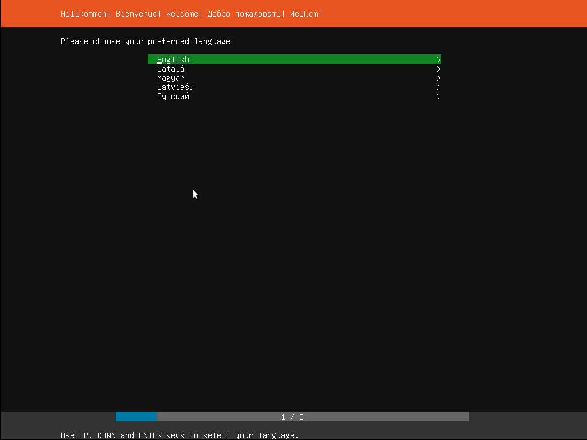
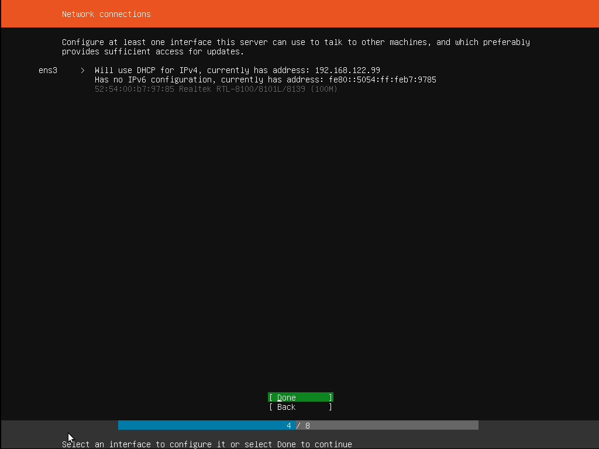
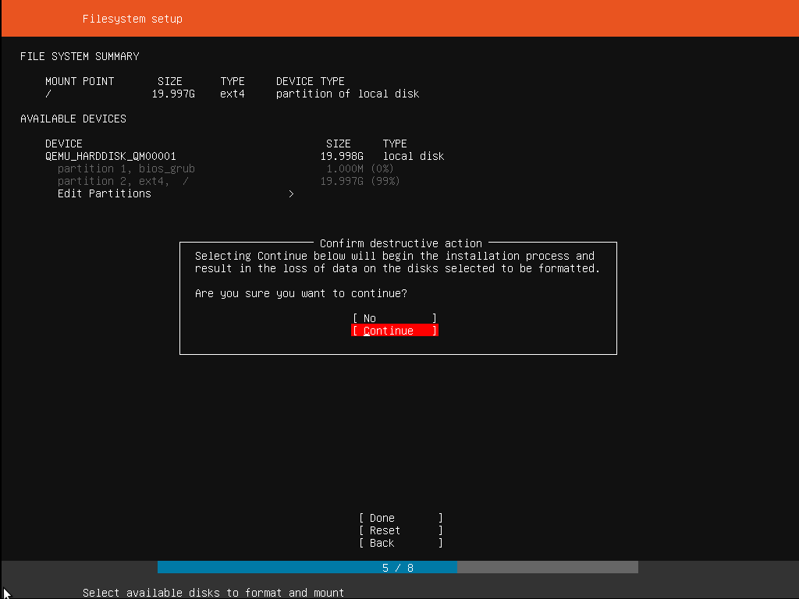

## Table of contents

- [1\. Overview](#1-overview)
- [2\. Requirements](#2-requirements)
- [3\. Boot from install media](#3-boot-from-install-media)
- [4\. Choose your language](#4-choose-your-language)
- [5\. Choose the correct keyboard layout](#5-choose-the-correct-keyboard-layout)
- [6\. Choose your install](#6-choose-your-install)
- [7\. Networking](#7-networking)
- [8\. Configure storage](#8-configure-storage)
- [9\. Select a device](#9-select-a-device)
- [10\. Confirm partitions](#10-confirm-partitions)
- [11\. Confirm changes](#11-confirm-changes)
- [12\. Set up a Profile](#12-set-up-a-profile)
- [13\. Install software](#13-install-software)
- [14\. Installation complete](#14-installation-complete)
- [15\. What next?](#15-what-next)
  - [Finding help](#finding-help)

## 1\. Overview

[Ubuntu Server](https://ubuntu.com/download/server) is a variant of the standard Ubuntu you already know, tailored for networks and services. It’s just as capable of running a simple file server as it is operating within a 50,000 node cloud. Download Ubuntu Server using [Link](https://ubuntu.com/download/server).

Unlike the installation of Ubuntu Desktop, Ubuntu Server does not include a graphical installation program. Instead, it uses a text menu-based process. If you’d rather install the desktop version, take a look at our [Install Ubuntu desktop](https://tutorials.ubuntu.com/tutorial/tutorial-install-ubuntu-desktop) tutorial.

This guide will provide an overview of the installation from either a DVD or a USB flash drive.

For a more detailed guide on Ubuntu Server’s capabilities and its configuration, take a look at our the [Community Ubuntu Server documentation](https://help.ubuntu.com/lts/serverguide/installation.html).

* * *

## 2\. Requirements

You’ll need to consider the following before starting the installation:

-   Ensure you have at least 20GB of free storage space.
-   If you’re going to install Ubuntu Server alongside data you wish to keep, ensure you have a recent backup.

See the [server guide pages](https://help.ubuntu.com/lts/serverguide/preparing-to-install.html#system-requirements) for more specific details on hardware requirements. We also have [several tutorials](https://ubuntu.com/tutorials?topic=server) that explain how to create an Ubuntu DVD or USB flash drive.

* * *

## 3\. Boot from install media

For this lab, we will not use a physical DVD or USB. Instead, you will install Ubuntu Server inside **VMware Workstation Pro**.

### Steps:

1. **Install VMware Workstation Pro**  
   - Download and install VMware Workstation Pro on your computer.  
   - (If it is already installed, you can skip this step.)

2. **Download Ubuntu Server ISO**  
   - Go to the [Ubuntu Server download page](https://ubuntu.com/download/server).  
   - Download the latest LTS version ISO file.

3. **Create a new virtual machine in VMware**  
   - Open VMware Workstation Pro.  
   - Click **Create a New Virtual Machine**.  
   - Select **Typical (recommended)**.  
   - When asked for installation media, choose **Installer disc image file (ISO)** and browse to the Ubuntu Server ISO you downloaded.  
   - Continue through the wizard, selecting the defaults unless otherwise instructed.

4. **Start the virtual machine**  
   - Once the VM is created, click **Power on this virtual machine**.  
   - The Ubuntu Server installer will boot using the ISO file.

After a few moments, you should see messages like those shown below on the screen…

Most computers will automatically boot from USB or DVD, though in some cases this is disabled to improve boot times. If you don’t see the boot message and the “Welcome” screen which should appear after it, you will need to set your computer to boot from the install media.

There should be an on-screen message when the computer starts telling you what key to press for settings or a boot menu. Depending on the manufacturer, this could be `Escape`, `F2`,`F10` or `F12`. Simply restart your computer and hold down this key until the boot menu appears, then select the drive with the Ubuntu install media.

If you are still having problems, check out the [Ubuntu Community documentation on booting from CD/DVD](https://help.ubuntu.com/community/BootFromCD).

* * *

## 4\. Choose your language

After the boot messages appear, a ‘Language’ menu will be displayed.

As the message suggests, use the `Up`, `Down` and `Enter` keys to navigate through the menu and select the language you wish to use.

* * *

## 5\. Choose the correct keyboard layout

Before you need to type anything in, the installer will next display a menu asking you to select your keyboard layout and, if applicable, the variant.

If you don’t know which particular variant you want, just go with the default - when Ubuntu Server has been installed you can test and change your preferences more easily if necessary.

* * *

## 6\. Choose your install

Now we are ready to select what you want to install. There are three options in the menu:

The bottom two options are used for installing specific components of a Metal As A Service (MAAS) install. If you are installing MAAS, you should check out the [MAAS documentation](https://docs.maas.io/) for more information on this! The rest of this tutorial assumes you select the first option, `Install Ubuntu`.

* * *

## 7\. Networking

The installer will automatically detect and try to configure any network connections via DHCP.

This is usually automatic and you will not have to enter anything on this screen, it is for information only.

If no network is found, the installer can continue anyway, it just won’t be able to check for updates. You can always configure networking after installation.

* * *

## 8\. Configure storage

The next step is to configure storage. The recommended install is to have an entire disk or partition set aside for running Ubuntu.

If you need to set up a more complicated system, the manual option will allow you to select and reorganise partitions on any connected drives.

Note that Ubuntu no longer *requires* a separate partition for swap space, nor will the automated install create one.

* * *

## 9\. Select a device

This menu will allow you to select a disk from the ones detected on the system.

To help identification, the drives will be listed using their system ID. Use the arrow keys and enter to select the disk you wish to use.

* * *

## 10\. Confirm partitions

With the target drive selected, the installer will calculate what partitions to create and present this information…

If this isn’t what you expected to see (e.g., you have selected the wrong drive), you should use the arrow keys and enter to select `Back` from the options at the bottom of the screen. This will take you back to the previous menu where you can select a different drive.

It is also possible to manually change the partitions here, by selecting `Edit Partitions`. Obviously you should only select this if you are familiar with how partitions work.

When you are happy with the disk layout displayed, select `Done` to continue.

* * *

## 11\. Confirm changes

Before the installer makes any destructive changes, it will show this final confirmation step. Double check that everything looks good here and you aren’t about to reformat the wrong device!

There is no “Undo” for this step, once you confirm the changes, the indicated devices will be overwritten and any contents may be lost

* * *

## 12\. Set up a Profile

The software is now being installed on the disk, but there is some more information the installer needs. Ubuntu Server needs to have at least one known user for the system, and a hostname. The user also needs a password.
At this step, you must provide details for the system user.

Please follow these rules carefully:

- **Your name** → Enter **your own name** (example: `Ali Raza`).
- **Your server name** → Enter **your roll number** (example: `20F-1234`).
- **Pick a username** → Use the **same as your name**, written in without spaces (example: `AliRaza`).
- **Choose a password** → Set a secure password that you will remember.

This ensures that every student’s server setup is unique and easy to identify.

There is also a field for importing SSH keys, either from Launchpad, Ubuntu One or Github. You simply need to enter the username and the installer will fetch the relevant keys and install them on the system ready for use (e.g. secure SSH login to the server).

* * *

## 13\. Install software

Once you have finished entering the required information, the screen will now show the progress of the installer. Ubuntu Server now installs a concise set of useful software required for servers. This cuts down on the install and setup time dramatically. Of course, after the install is finished, you can install any additional software you may need.

* * *

## 14\. Installation complete

When the install is complete, you will see a message like this on the screen.

Remember to remove the install media, and then press enter to reboot and start the server. Welcome to Ubuntu!

* * *

## 15\. What next?

With Ubuntu Server installed, you can now carry on and build that file-server or multi-node cluster we mentioned!

If you are new to Ubuntu Server, we’d recommend reading the [Server Guide](https://help.ubuntu.com/lts/serverguide/installation.html).

You can also check out the latest on Ubuntu Server, and what others are using it for on the [Ubuntu Server pages](https://www.ubuntu.com/server).

### Finding help

The Ubuntu community, for both desktop and server, is one of the friendliest and most well populated you can find. That means if you get stuck, someone has probably already seen and solved the same problem.

Try asking for help in one of the following places:

-   [Ubuntu Discourse](https://discourse.ubuntu.com/)
-   [Ask Ubuntu](https://askubuntu.com/)
-   [IRC-based support](https://wiki.ubuntu.com/IRC/ChannelList)

Alternatively, if you need commercial support for your server deployments, take a look at [Ubuntu Advantage](https://www.ubuntu.com/support).

Was this tutorial useful?

-    
    
-    
    
-    
    

Thank you for your feedback.

* * *
